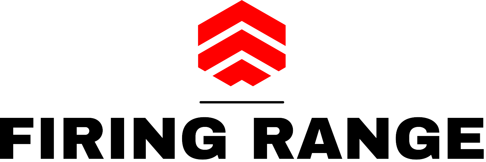

# FiringRange3D_OpenGL
<!-- PROJECT SHIELDS -->
<!---
*** I'm using markdown "reference style" links for readability.
*** Reference links are enclosed in brackets [ ] instead of parentheses ( ).
*** See the bottom of this document for the declaration of the reference variables
*** for contributors-url, forks-url, etc. This is an optional, concise syntax you may use.
*** https://www.markdownguide.org/basic-syntax/#reference-style-links

[![Contributors][contributors-shield]][contributors-url]
[![Stargazers][stars-shield]][stars-url]
[![Issues][issues-shield]][issues-url]
-->

<!-- PROJECT LOGO -->
<br />
<p align="center">
  <a href="https://github.com/ParthenopeDeepTeam/Fall-Detection-using-LSTM-Autoencoder">
    
  </a>

  <h3 align="center">Abstract</h3>

  <p align="justify">An OpenGL and GLUT based 3D videogame, where the player has to complete different levels shooting the targets with a certain amount of bullets.
    <br />
</p>

<h5 align="center">Example of play:</h5>

<p align="center">
    
    <br>
</p>

<!-- TABLE OF CONTENTS -->
<details open="open">
  <summary><h2 style="display: inline-block">Table of Contents</h2></summary>
  <ol>
    <li>
      <a href="#about-the-project">About The Project</a>
      <ul>
        <li><a href="#Libraries">Libraries</a></li>
      </ul>
    </li>
    <li>
      <a href="#getting-started">Getting Started</a>
      <ul>
        <li><a href="#code-structure">Code structure</a></li>
      </ul>
    </li>
    <li><a href="#contacts">Contacts</a></li>
  </ol>
</details>


<!-- ABOUT THE PROJECT -->
## About The Project

<p align="justify">
In this work we propose an OpenGL and GLUT based videogame where the player, in order to win the game, has to hit all the targets (two times, each shot removes 50% of their "life"). The project is basically composed by three scenes: the menù, the game area and the scoreboard.
The goal of the game is to eliminate all targets in a set time interval with a certain number of bullets available; the target movement speed and the amount of bullets available are dependent on the selected difficulty.
</p>

### Libraries

* [OpenGL/glew 1.12.0](https://www.nuget.org/packages/glew.v140/1.12.0) - Graphics and related
* [GLUT/freeglut 1.0.2](https://www.nuget.org/packages/freeglut.3.0.0.v140/1.0.2) - Window managing, interaction and callbacks setting
* [irrKlang 1.6.0](https://www.ambiera.com/irrklang/) - Audio effects and musics
* [SOIL 1.16.0](https://github.com/littlstar/soil) - Texture loading

<!-- GETTING STARTED -->
## Getting Started

Istructions for code and installation are down below.


<!-- CODE STRUCTURE -->
### Code structure

```
src
├── main.cpp
│   ──> contains the window creation, the callbacks and the drawing routine
├── GameAssets.cpp
│   ──> contains the class for the texture loading
├── GenericModel.h
│   ──> contains the 3D model class that is extendes by Bullet, Target etc...
| ...
```

<!-- Installation and usage -->
### Installation and usage
The project has been developed by using Visual Studio Code 2022, so we highly recommend this IDE in order to clone this repo and try to develop and improve this work. The VSC files are missing, so you need to create first a blank project and inputting the source code of this repo into it.

<!-- CONTACT -->
## Contacts

* Andrea: [LinkedIn][linkedin-andrea-url]
* Vincenzo: [LinkedIn][linkedin-vincenzo-url]


<!-- MARKDOWN LINKS & IMAGES -->
<!-- https://www.markdownguide.org/basic-syntax/#reference-style-links -->
[contributors-shield]: https://img.shields.io/github/contributors/github_username/repo.svg?style=for-the-badge
[contributors-url]: https://github.com/ParthenopeDeepTeam/Fall-Detection-using-LSTM-Autoencoder/graphs/contributors
[stars-shield]: https://img.shields.io/github/stars/github_username/repo.svg?style=for-the-badge
[stars-url]: https://github.com/github_username/repo/stargazers
[issues-shield]: https://img.shields.io/github/issues/github_username/repo.svg?style=for-the-badge
[issues-url]: https://github.com/ParthenopeDeepTeam/Fall-Detection-using-LSTM-Autoencoder/issues
[linkedin-shield]: https://img.shields.io/badge/-LinkedIn-black.svg?style=for-the-badge&logo=linkedin&colorB=555
[linkedin-andrea-url]: https://www.linkedin.com/in/andrea-lombardi/
[linkedin-vincenzo-url]: https://www.linkedin.com/in/vincenzo-silvio-0413321b8/
